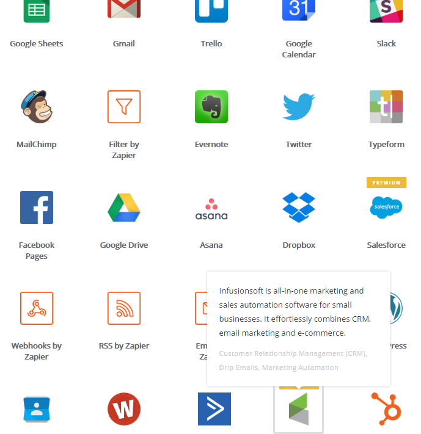

# GraphQL
> GraphQL is an query for application and thin API layer,

## GraphQL 과 REST APIs
 * https://medium.com/chute-engineering/graphql-in-the-age-of-rest-apis-b10f2bf09bba#.tfhd9p82n
 * http://www.slideshare.net/deview/112rest-graph-ql-relay

## SOAP 이 REST 로 대체된 때를 생각해라
 * 업계에서 일반적으로 대체된다면 오래 걸리지 않겠나? 10년?
 * 동시 지원도 할거고...

## 무엇이 더 좋은가?

### 서버의 단방향 응답구조를 개선하여 클라이언트에게 유연성을 부여

### 클라이언트의 단편화된 요청 구문(REST API)을 다중화 시키고 커뮤니케이션 표준화를 꽤 한다.
 * React 와 Angular 에서 Rest API 는 많이 쪼개져 있고 클라이언트(브라우저)에서 여러번의 요청으로 하나의 업무가 완료된다.
   * REST API : 글 내용을 가져온다. 글 코멘트를 가져온다. 코멘트의 작성자 정보를 가져온다.
   * GraphQL : 글 내용과, 글 코멘트 그리고 코멘트 작성자 정보를 Query 로 정의해 가져온다. (exposed schme base)
 * 도메인 구분이 명확해 진다.
 * API 레이어는 가볍고 유연해 진다.

### 왜 JSON Schema 가 아닌가?
 * 표준으로 쓰기에는 스펙(인트로스펙션 등)과 확장성이 부족하다.
 * 유사한 대안으로 JSON-LD, JSON Schema 가 있다.
 * 비교 > http://react-etc.net/entry/graphql-json-ld-and-json-schema-formats-explained

## 예제
### 스키마 및 서버
```
const Users = {
    ktlee:
    {   
        _id: "ktlee",
        name:"이기a",
        age:37,
        address:"Daegu"
    },
    sw1626:
    {   
        _id: "sw1626",
        name:"류지b",
        age:36,
        address:"Ulsan"
    },
    choon:
    {
        _id:"choon",
        name:"춘차c",
        age:37
    }
};

const User = new GraphQLObjectType({
    name: 'User',
    fields: {
        _id: {
            type: new GraphQLNonNull(GraphQLString),
            description:"유저키"
        },
        name: {
            type: new GraphQLNonNull(GraphQLString),
            description:"이름"
        },
        age: {
            type:GraphQLInt,
            descrption:"나이"
        },
        address: {
            type: new GraphQLNonNull(GraphQLString),
            resolve: function(user) {
                return user.address || "Does not exist";
            }
        }
    }
});

const Query = new GraphQLObjectType({
    name: 'RootQueryType',
    fields: () => ({
        users: {
            type: new GraphQLList(User),
            resolve: () => _.values(Users)
        }
    })
});

const schema = new GraphQLSchema({
    query: Query,
    mutation: Mutation
});
```
### 요청
```
curl -X POST -H "Content-Type: application/graphql" -d 'query { users { name, age, address } }' "http://localhost:3000/graphql"
```
### 응답
```
{
  "data": {
    "users": [
      {
        "name": "이기a",
        "age": 27,
        "address": "Daegu"
      },
      {
        "name": "류지b",
        "age": 26,
        "address": "Ulsan"
      },
      {
        "name": "춘차c",
        "age": 37,
        "address": "Does not exist"
      }
    ]
  }
}
```

## GraphQL 과 REST 함께 쓰기
 * 클라이언트 <-단일요청-> GraphQL Server <-다중요청가능-> REST Server
   * 서버는 훨씬 높은 대역폭이 있으므로 서버에서의 다중처리는 문제가 없다.

## Relay
 > Client(Relay <-> graphql-rest(?)) <-> REST Server`

 * React 를 위한 GraphQL 클라이언트 라이브러리
 * GraphQL 서버에서 데이터 가져오기를 추상화하는 플러그 형 전송 계층
 * 서버가 원격에서 실행될 필요는 없고, 클라이언트의 요소로써 패키지 된다.

## Graphcool https://www.graph.cool/
> GraphQL Schema 서비스

 * 프로젝트 생성
   * 프로젝트별 API 엔드포인트 생성됨.
 * 프로젝트내에 모델 생성
 * 모델간 관계 설정
 * 모델의 CRUD 별로 공개/비공개(인증기반) 퍼미션 설정 가능
 * 모델의 Mutation(생성/수정/삭제 후) 수행 후 webhook(mutation callback 이라 부름) 지원
   * payload 커스터마이즈 설정 가능
   * webhook을 통해 zaiper 와 함께 수많은 타 서비스와 연계 가능
     * Slack 연동 https://www.graph.cool/docs/tutorials/slack-notifications-with-mutation-callbacks-dah6aifoce#1.1-setting-up-slack
        
     * 참고 https://enumgames.slack.com/archives/study-meshup

 * GraphiQL 지원
 * 모델 및 관계 등 수정시에 query 및 mutation 자동으로 만들어줌.

## link
 * 기초 이러닝 https://learngraphql.com/
   * 샌드박스 https://sandbox.learngraphql.com/

 * REST에서 GraphQL 과 Relay로 갈아타기 http://www.slideshare.net/deview/112rest-graph-ql-relay
 * awsome GraphQL https://github.com/chentsulin/awesome-graphql
 * babel inline import https://github.com/quadric/babel-plugin-inline-Import
   * support json, graphql, sql, text, raw and so on
